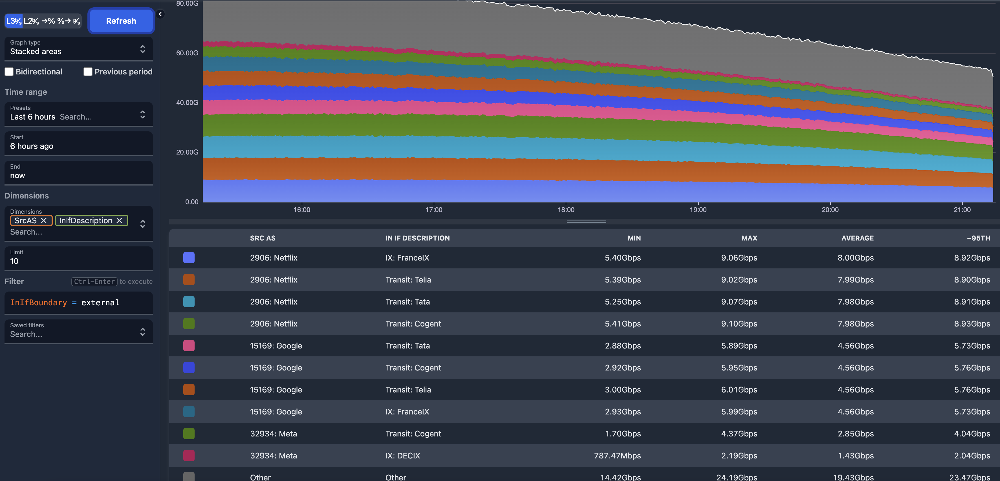

[Akvorado](https://github.com/akvorado/akvorado) is a very powerful tool in network engineer's toolbox. 
We use it at Ryamer to help us identify how traffic comes into and our of our network and optimize that by seeing if we could shift any of that traffic over to the [IX](/docs/Peering/IX) that we are part of.
But today I'm not here to talk about how we've reduced costs at Ryamer, but instead on another larger network, who we are going to call X(not the one formerly known as Twitter) for now.

What is Akvorado? It's a flow analyzer that takes in Netflow/Sflow data and makes nice and pretty charts that humans can use in order to get an eye at their network. With some work, you can configure Akvorado to tell you what port the traffic came in and out of.
Now with that comes a great feature, we can mark ports as transit or peering, and almost always peering ports are cheaper than transit ports.

On network X, after setting up Akvorado, we were able to see something. There was a lot of incoming traffic from [AS32934 aka Facebook aka Meta](https://bgp.tools/as/32934), and both network X and AS32934 were connected to a mutual internet exchange, AMS-IX.
But the traffic wasn't coming in from the AMS-IX port, instead it was coming from the transit port. That means that Facebook most likely doesn't participate in the route servers at AMS-IX. With that knowledge, we were able to simply request peering with AS32934.
After a few days, the sessions were up and all of that traffic which used to be coming in via the transit port got moved over to the peering port.

Facebook was the largest source of incoming traffic for said network. Getting that off of transit and onto the peering port cut the usage of the transit port by a huge amount, and in fact after doing this with a few more networks(looking at both inbound and outbound traffic) we were able to get this to a point where the IX port handled a larger part of the traffic than transit.
Of course it does help that AMS-IX is such a large and well connected exchange where a lot of large networks meet at. 

Another thing that Akvorado does is reveal the 95th percentile of traffic. If you know you are getting close to exceeding your commit and will start getting charged for overages, you can shift traffic over to another transit port in order to not get hit by those fees.

But anyone can use the same tricks at any other point. Akvorado is free to run and it's very easy to configure. Half an hour of work and you too can get great insight into your network.
At Ryamer, we are actively trying to improve our network connectivity and reduce latency by peering with as many networks as it makes sense to. Akvorado has helped us see what networks we talk to a lot and plan out capacity increases.